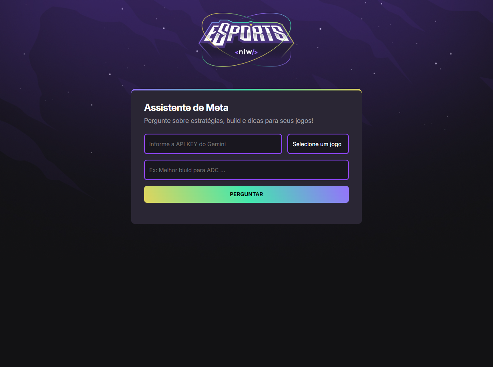

# 🎉 IA Assistente gamer | Rocketseat NLW-20

🚀 Uma aplicação desenvolvida durante o evento **Next Level Week - NLW** da Rocketseat, que auxilia jogadores a buscar informações relevantes, como dicas, biulds e estratégias dos seus jogos.



## 📌 Sobre o Projeto
Um projeto inovador desenvolvido durante a NLW da Rocketseat, que auxilia jogadores a ter uma experiência mais inteligente em jogos.

---

## 🎯 Objetivo Principal
Desenvolver uma aplicação web que utilize Inteligência Artificial para o auxílio de gamers.

---

## 💻 Tecnologias Utilizadas
- HTML5
- CSS3
- Javascript
- IA

---

## 🚀 Instalação e Execução
1. Clone o repositório:
```bash
git clone https://github.com/devalefhilima/NLW-Agents
````
2. Acesse o diretório do projeto:
```bash
cd NLW-AGENTS
```
3. Abra o arquivo index.html no seu navegador.
